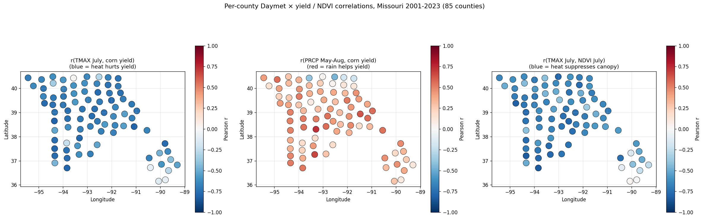

# Agri Yield Pipeline

End-to-end agricultural monitoring system: satellite NDVI (Sentinel-2 via Google Earth Engine), real-time NOAA/USDA ingestion, Kafka streaming, InfluxDB/PostgreSQL storage, and ML yield prediction for Missouri corn production.

## Takeaways

**Data (2001–2023, 97 MO counties, 1,658 county-years):**

- **NDVI → yield signal is real but heterogeneous.** Pearson r = 0.52 between
  peak summer NDVI and corn yield statewide; GBR CV R² = 0.681 vs 0.785 for the
  6 homogeneous NW-county subset. A single state-wide regression
  under-predicts on the glacial-till corn belt and over-predicts on Ozark
  pasture / Bootheel rice paddies.
- **July is the hinge month.** `ndvi_july` is the single most important
  feature (0.28), followed by `drought_flag` (0.15), `prcp_may_aug` (0.13),
  and `tmax_july_mean` (0.13). Pollination-window stress dominates annual
  yield variance.
- **Known drought years show up cleanly** in the statewide trend lines for
  2012 and 2022 across corn / soy / sorghum — sanity check that MODIS +
  GHCND + NASS are aligned.
- **GBR beats Ridge by ~3×** on R² (0.681 vs 0.208). The 97 county one-hot
  features are too coarse for a linear model to recover per-region intercepts.
- **Top corn counties** in the 2015–2023 average cluster along the Missouri
  River bottom (Atchison, Holt, Nodaway, Andrew, Buchanan) — consistent with
  published USDA rankings.

**Pipeline:**

- Baseline runs end-to-end from cached parquets with no Kafka / Postgres /
  InfluxDB. `dash_baseline.py` is the proof: `python dash_baseline.py`
  → `http://127.0.0.1:8050`.
- Kaleido + remote-geojson hangs in headless Chromium; the matplotlib
  centroid-bubble fallback (`scripts/generate_choropleth_static.py`) is
  reliable and renders in < 1 s.
- The 8-commodity USDA pull
  (`data/real/usda_allcrops_county_missouri_2001_2023.parquet`, 7,890 rows,
  116 counties) feeds both the ML baseline and the companion `career-ops`
  MO-geo job scorer — same parquet, two consumers.

## Product strategy

This repo is **two products, one parquet cache** — not one product.

| Layer                 | Role                         | Data source                                    | Cadence                          |
|-----------------------|------------------------------|------------------------------------------------|----------------------------------|
| **L1 — Historical**   | training / ground truth      | USDA NASS yields + NOAA GHCND + Daymet + MODIS MOD13Q1 NDVI, 2001–2023 | yearly refresh (NASS lag ~12 mo) |
| **L2 — Live fields**  | inference / per-customer ops | Sentinel-2 NDVI + Sentinel-1 SAR via GEE        | weekly per field                 |

L1 is the defensible corpus — 23 years of county-level truth that takes
time to assemble. L2 is the real-time anomaly stream scored against L1's
expected trajectory. The story no single-layer competitor can tell:

> *"Field X is 1.6σ below expected NDVI trajectory for DOY 195 given
> Boone County's 2001–2023 history."*

**Why Google Earth Engine is the substrate for L2:**

1. **Geographic portability** — the same `export_fields_ndvi.py` runs
   Iowa, São Paulo, or Punjab by editing `fields.yml`. No per-region
   API integrations, no per-country license negotiation.
2. **Multi-sensor at one seam** — S2 (optical), S1 (radar/moisture),
   Landsat 8/9 TIRS (thermal/ET), MODIS LST, SMAP (soil moisture),
   CHIRPS (rainfall) — all indexable by the same `ee.Geometry + date
   range`. Adding thermal-stress pings later is ~40 LoC.
3. **Cheap for sparse queries** — noncommercial is free; commercial
   per-compute-hour pricing rounds to pennies for "20 fields × weekly
   1 km² exports." Cost only matters at whole-country monitoring scale,
   which is the *opposite* of this use case.

**Where GEE is the wrong tool.** Parametric ag-insurance triggers or
irrigation valve control need <1 h latency; S2 post-acquisition lag is
6–24 h and S1 is 2–3 days. That's a Planet Labs (daily 3 m) problem,
not a GEE problem — don't bolt sub-hour latency onto this pipeline.

**Tenant silo options:**

- **Per-tenant silo** — one `fields.yml` + one `data/fields/<tenant>/`
  tree per customer. Clean data boundaries, straightforward billing.
  What this repo scales to naturally.
- **Global silo + `tenant_id` column** — one fields table keyed by
  tenant, one geotiff prefix per field globally. Unlocks cross-tenant
  ML: train one yield model on 10,000 fields across crops/regions
  instead of 20 fields per tenant. Higher-ceiling ML play.

## ML Results

**Statewide real-data baseline** — MODIS MOD13Q1 NDVI (250 m, 16-day composite) +
daily weather + USDA NASS county yields, **97 Missouri counties**, 2001–2023,
**1,658 county-years**.

| Variant                                         | Weather source                  | Features | CV R² | CV RMSE (bu/ac) |
|-------------------------------------------------|---------------------------------|:-------:|:-----:|:---------------:|
| A. Ridge (baseline)                             | NOAA GHCND, KC MCI (1 station)  | 106     | 0.208 | 30.5            |
| B. GBR + KC single station                      | NOAA GHCND, KC MCI (1 station)  | 106     | 0.681 | 19.4            |
| C. GBR + Daymet per county                      | Daymet 1-km per centroid        | 106     | 0.610 | 21.4            |
| **D. GBR + Daymet per county + year FE**        | Daymet 1-km + year dummies      | 129     | **0.713** | **18.4**    |

**Why the naïve per-county swap (C) *hurt* R² and the fix (D) helps.**
The KC-only feature set has 0% within-year variance — every county's
2012 row carried the same `drought_flag`/`tmax_july_mean`, so GBR was
implicitly learning a year fixed effect through the weather features.
Swapping in Daymet splits weather variance ~50/50 between spatial and
temporal (so 2012 is a moderate drought in the Ozarks, a severe drought
along the Missouri River), which dissolves the year-as-macro-signal and
the model loses its implicit year effect. Adding explicit year dummies
(variant D) restores the year effect *and* lets GBR use real local
weather deviations on top — best of both worlds, +3 points of R² over
the KC baseline.

Counties with the biggest residual improvement under Daymet are exactly
the ones whose climate differs most from KC: Madison (bias −30 → −15),
Wright (+13 → +7), Dent (−33 → −28).

**Models.** *Ridge* is L2-penalized linear regression (`sklearn.linear_model.Ridge`);
adding `α‖β‖²` to the loss stabilizes coefficients when features are correlated —
`ndvi_june / ndvi_july / ndvi_mean_growing` all move together, and the 97 county
dummies are near-collinear with the intercept. It's the baseline sanity check.
*GBR* is the Gradient Boosting Regressor (`sklearn.ensemble.GradientBoostingRegressor`,
300 trees × depth 3, lr 0.05, subsample 0.8) — an ensemble that fits each new tree
to the residuals of the prior ensemble. It wins by ~3× here (R² 0.681 vs 0.208)
because it captures the non-linear NDVI→yield saturation, the drought × NDVI
interaction, and per-county intercepts — all of which a linear model either
can't represent or has its coefficients shrunk away.

Top GBR features (statewide): `ndvi_july` (0.28), `drought_flag` (0.15),
`prcp_may_aug` (0.13), `tmax_july_mean` (0.13), `ndvi_mean_growing` (0.11).
Going from 6 homogeneous NW counties (R²=0.785) to all 97 yield-bearing
counties (R²=0.681) reflects real agroclimatic heterogeneity: the Bootheel
rice paddies, Ozark pasture, and Glacial-till corn belt don't share a single
NDVI→yield slope.

### Corn yield map — avg 2015-2023


Interactive (plotly): [`figures/real/choropleth_corn_yield.html`](figures/real/choropleth_corn_yield.html).

### NDVI vs corn yield (full state)


Pearson r = 0.52 between peak summer NDVI and corn yield across 1,658 observations.

### Multi-crop coverage


USDA NASS coverage for 8 commodities (CORN, SOYBEANS, WHEAT, SORGHUM, COTTON,
RICE, OATS, HAY) written to `data/real/usda_allcrops_county_missouri_2001_2023.parquet`
(7,890 rows, 116 counties).

### Per-county Daymet × yield / NDVI correlations


23 years of growing-season weather vs yield / canopy, one dot per county
(85 counties with ≥10 paired years). **July heat hurts corn yield in 84/85
counties** (mean r=−0.63), **May-Aug rain helps in 81/85** (mean r=+0.33),
and **canopy heat-stress tracks in 84/85** (mean r=−0.61). The
near-universal sign confirms the features aren't cosmetic — they're the
real weather-response signal the statewide GBR is exploiting.

### GBR feature importance + per-county residuals


**Reading the residuals chart.** Each horizontal bar is the mean of
`actual − predicted` corn yield for one county across all years.
**Green (positive)** → GBR *under-predicts* (actual is higher than modeled).
**Red (negative)** → GBR *over-predicts* (actual is lower). Bar length is the
bias magnitude in bu/acre. Across the 97 counties: 16 are within ±2 bu/acre,
44 within ±5, and only 7 exceed |10|; the statewide mean residual is
−1.3 bu/acre, so there is no global offset.

The geographic pattern is the real story:

| Region                       | Bias direction             | Representative counties                                           |
|------------------------------|----------------------------|-------------------------------------------------------------------|
| Missouri River bottom (loess)| green / under-predicted    | Buchanan +8.5, Platte +7.3, Lafayette +7.2, Chariton +7.6, Ray +7.6 |
| Bootheel alluvial plain      | green / under-predicted    | Scott +7.7, New Madrid +7.6                                       |
| Ozark plateau                | red / over-predicted       | Christian −11, Dallas −10, Texas −8.8, Wayne −8.3                 |
| Single-year outliers (n=1)   | large red tails            | Dent −33, Madison −30, Pulaski −21                                |

GBR is **helpful everywhere** — it still beats Ridge ~3× on every subset —
but it has been shrunk toward the statewide mean for the tail regions. The
Missouri River bottom genuinely out-yields what NDVI + weather alone predict
(richer soils, irrigation); the Ozarks genuinely under-yield (corn is
marginal acreage). The negative `mean ↔ std` correlation (−0.22) says
biased counties also have higher variance, another sign that distinct
agro-regions are being blended into a single fit. Two fixes worth exploring:
(1) per-region GBR (river bottom / Ozark / Bootheel / N-Missouri), or
(2) additional features — soil class, elevation, irrigated-acre fraction —
so the model can separate *low NDVI because Ozark pasture* from *low NDVI
because drought stress*. The current 97 county-dummies are a crude substitute.

### Earlier models


## Table of Contents
1. [Prerequisites](#prerequisites)
2. [Clone & Setup](#clone--setup)
3. [Environment Configuration](#environment-configuration)
4. [Docker Services](#docker-services)
5. [Real-Time Data Ingestion](#real-time-data-ingestion)
6. [Stream Processing](#stream-processing)
7. [Dashboard Access](#dashboard-access)
8. [API Endpoints](#api-endpoints)
9. [Troubleshooting Tips](#troubleshooting-tips)

### Real-data baseline

With `NOAA_API_TOKEN` and `USDA_API_KEY` set in `.env`:

```bash
python3.11 -m venv .venv && .venv/bin/pip install -r requirements.txt
# 6-county quick start (~5 min):
.venv/bin/python scripts/fetch_real_data.py
# Statewide MO — NDVI for every county with USDA yields (~6 h, one-time):
.venv/bin/python scripts/fetch_all_counties.py
# All 8 MO commodities (CORN, SOYBEANS, WHEAT, SORGHUM, COTTON, RICE, OATS, HAY):
.venv/bin/python scripts/fetch_usda_all_crops.py
# Per-county Daymet 1-km daily weather (~4 min, 115 counties):
.venv/bin/python scripts/fetch_daymet_per_county.py
# Train + figures (includes the three-way KC vs Daymet vs Daymet+YearFE comparison):
.venv/bin/python scripts/train_real.py
.venv/bin/python scripts/train_real_daymet.py
.venv/bin/python scripts/generate_full_figures.py
.venv/bin/python scripts/generate_choropleth_static.py
# Per-county Daymet x yield / NDVI correlation choropleth (85 counties):
.venv/bin/python scripts/generate_daymet_correlation_maps.py
```

MODIS NDVI comes from the ORNL DAAC REST endpoint (no auth). NOAA GHCND daily
weather and USDA NASS yields require the respective tokens. Reruns hit the
parquet cache; each NDVI parquet is 250 m × 250 m × 16-day, 2001–2023.

### Per-field monitoring (Sentinel-2 NDVI + Sentinel-1 SAR)

For a small, known set of AOIs (3–20 fields, ~ha-scale), the right
pattern is **export once, cache locally** — nothing in the loop has to
reach back to Earth Engine once the TIFFs are on disk. Covers the
agronomist use case: per-field NDVI anomalies for stress flags, VV
backscatter as a soil-moisture *proxy*, and a quick acreage estimate
from the NDVI mask.

**One-time GCP setup** (free tier is fine):

1. Create / pick a GCP project; enable the **Earth Engine API**.
2. [Register the project](https://code.earthengine.google.com/register)
   for Earth Engine non-commercial use.
3. IAM → **Create service account** → grant role `Earth Engine Resource Viewer`.
4. Create a JSON key for the SA and drop it at
   `/Users/aurascoper/agri_yield_pipeline/ee-service-account.json`
   (`.gitignore`d).
5. Add to `.env`:
   ```dotenv
   GCP_PROJECT=agri-yield-pipeline
   EE_SERVICE_ACCOUNT=<name>@<project>.iam.gserviceaccount.com
   EE_SA_KEY_FILE=/Users/aurascoper/agri_yield_pipeline/ee-service-account.json
   ```
   If `EE_SERVICE_ACCOUNT` is unset, `src/ee_auth.init_ee()` falls back
   to user OAuth (`earthengine authenticate`).

**Fields quickstart:**

```bash
cp fields.yml.example fields.yml   # then edit lat/lon/buffer for each AOI
.venv/bin/python scripts/export_fields_ndvi.py   # Sentinel-2 NDVI @ 10 m
.venv/bin/python scripts/export_fields_sar.py    # Sentinel-1 VV dB @ 10 m
.venv/bin/python dash_baseline.py                # → Fields tab
```

Per field, you get:
- `data/fields/<name>/ndvi_<YYYY-MM-DD>.tif` + `ndvi_series.parquet`
- `data/fields/<name>/sar_<YYYY-MM-DD>.tif`  + `sar_series.parquet`

The Fields tab shows NDVI/VV tile previews, the DOY z-score against the
field's own prior-years baseline (flags stress when NDVI z < −1 or VV
anomaly > 2 dB dry), and a rough vegetated-hectares estimate from
NDVI > 0.3. Rerun the exporters weekly; they only pull new scenes.

### Stress alerts — Layer 1 grounds Layer 2

`scripts/field_stress_alerts.py` scores each field's recent Sentinel-2
NDVI against its nearest MO county's 2001–2023 MOD13Q1 baseline (same
DOY ±7 days across 23 years). Severity: `info` < `warn` (|z|≥1.5) <
`stress` (|z|≥2.0). Pipes to JSON for Slack/email/dashboards:

```bash
.venv/bin/python scripts/field_stress_alerts.py --lookback 21
```

Example ping:

```json
{
  "field": "boone_cafnr_field_1",
  "date": "2024-10-22",
  "ndvi": 0.525,
  "county": "Boone",
  "county_doy_mu": 0.605,
  "z": -1.62,
  "severity": "warn",
  "message": "boone_cafnr_field_1: NDVI 0.53 on 2024-10-22 is 1.6σ below the 2001–2023 Boone County mean of 0.60 for DOY 296."
}
```

Cross-sensor caveat: field NDVI is Sentinel-2 @ 10 m, county baseline
is MODIS MOD13Q1 @ 250 m. The z-score normalizes scale, but the
baseline is biased. Upgrade path: once a field accumulates ≥3 years of
S2 history, swap to that field's own DOY baseline (see
`dash_baseline.field_baseline_z`).

### Baseline dashboard (no Docker, no Postgres)

```bash
.venv/bin/python dash_baseline.py
# → http://127.0.0.1:8050
```

Reads directly from the cached parquets — county map with year-range slider,
per-crop statewide trend, per-county NDVI time series, per-county yield series,
and the per-county Daymet correlation panel. The production `dash_app.py`
still requires PostgreSQL + InfluxDB (see [Docker Services](#docker-services)).

### Deploy to Render (free tier)

`render.yaml` is already in the repo; the Statewide MO tab is the
deployable product (the Fields tab needs the local GEE cache, so it
gracefully shows an "empty" notice when `data/fields/` is absent).

1. Push the repo to GitHub (already done).
2. https://dashboard.render.com → **New → Blueprint** → point at this repo.
3. Render auto-detects `render.yaml`, provisions a Python 3.11 web
   service, runs `gunicorn dash_baseline:server`.
4. First boot ~3–5 min; subsequent deploys <60 s.

No secrets needed for Statewide-only. To also serve the Fields tab
live, set `EE_SERVICE_ACCOUNT`, `EE_SA_KEY_FILE_CONTENTS` (base64), and
`GCP_PROJECT` in Render's env vars and add a build-step that writes
the key to disk — but that's only worth it for a real tenant.

## Prerequisites
- Git (for cloning the repo)
- Docker & Docker Compose (v3.8+)
- Python 3.9+ (for running local scripts)
- Google Earth Engine CLI (`earthengine`)

## Clone & Setup
```bash
git clone https://github.com/aurascoper/agri_yield_pipeline.git
cd agri_yield_pipeline
```

## Environment Configuration
Create a `.env` file in the project root with the following variables:
```dotenv
NOAA_API_TOKEN=<your_noaa_api_token>
USDA_API_KEY=<your_usda_api_key>
INFLUXDB_URL=http://localhost:8086
INFLUXDB_TOKEN=<your_influxdb_token>
INFLUXDB_ORG=<your_org>
INFLUXDB_BUCKET=<your_bucket>
POSTGRES_USER=user
POSTGRES_PASSWORD=password
POSTGRES_DB=alerts
INFLUXDB_INIT_USERNAME=admin
INFLUXDB_INIT_PASSWORD=password
# (Optional) Kafka settings:
KAFKA_BOOTSTRAP_SERVERS=localhost:9092
KAFKA_GROUP_ID=processor-group
# (Optional) Redis URL:
REDIS_URL=redis://localhost:6379/0
```
Authenticate with Google Earth Engine:
```bash
earthengine authenticate
```

## Docker Services
Start core services:
```bash
docker-compose up -d
```
Services launched:
- Zookeeper & Kafka
- Redis
- PostgreSQL
- InfluxDB (initialized with your `.env` settings)
- Stream Processor
- Dash Dashboard

Check status and logs:
```bash
docker-compose ps
docker-compose logs -f
```

## Real-Time Data Ingestion
Fetch NOAA weather and USDA yield data into InfluxDB and Kafka:
```bash
python src/data_ingestion/live_ingestor.py \
  --start-date 2021-01-01 \
  --end-date 2021-12-31 \
  --station-id GHCND:USW00003952 \
  --year 2021
```

## Stream Processing
Consumes raw Kafka topics (`weather`, `yield`), enriches data, and writes to:
- Kafka output topic (`enriched-yield`)
- InfluxDB (for dashboard queries)
- Redis (for alerts cache)

Run via Docker Compose (already started above):
```bash
docker-compose up -d stream-processor
```
Or locally:
```bash
python src/processing/stream_processor.py
```

## Dashboard Access
The live Dash dashboard is available at:
http://localhost:8050

To run locally:
```bash
python src/visualization/live_dashboard.py
```

## API Endpoints
Backend API with FastAPI (NDVI & weather):
```bash
uvicorn api.main:app --reload
```
- GET `/ndvi/`
- GET `/weather/`

## Troubleshooting Tips
- Ensure `.env` is correctly configured and contains all required variables.  
- Verify no port conflicts on 5432, 6379, 8086, 8050, and 9092.  
- Use `docker-compose ps` and `docker-compose logs <service>` for diagnostics.  
- Access InfluxDB UI at http://localhost:8086 (use credentials from `.env`).  
- Test Redis with `redis-cli -u redis://localhost:6379/0`.  
- Confirm Google Earth Engine authentication: `earthengine authenticate`.

## License
Released under the [MIT License](LICENSE).  
