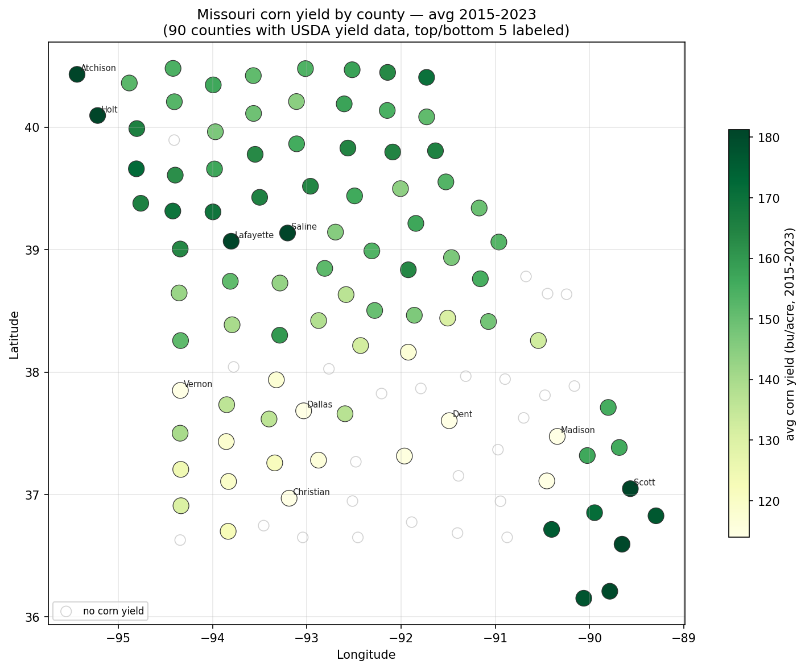
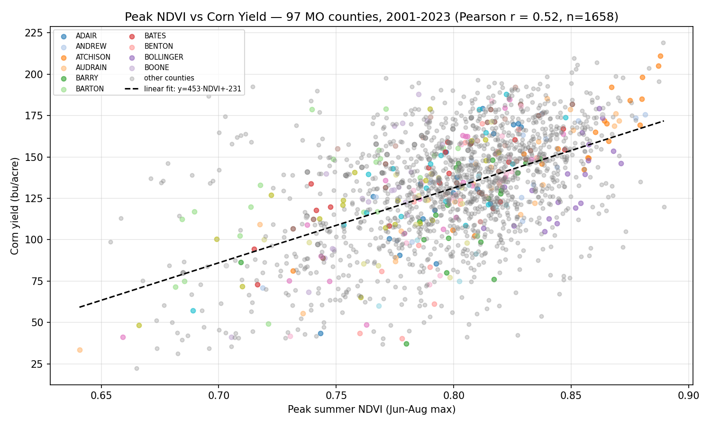
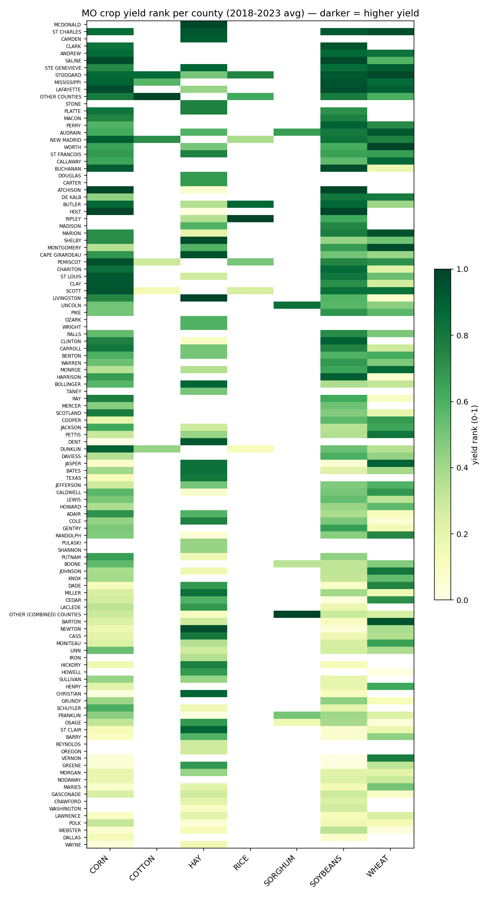
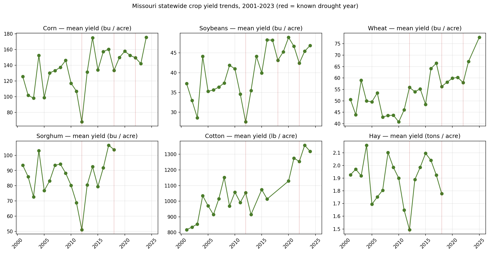
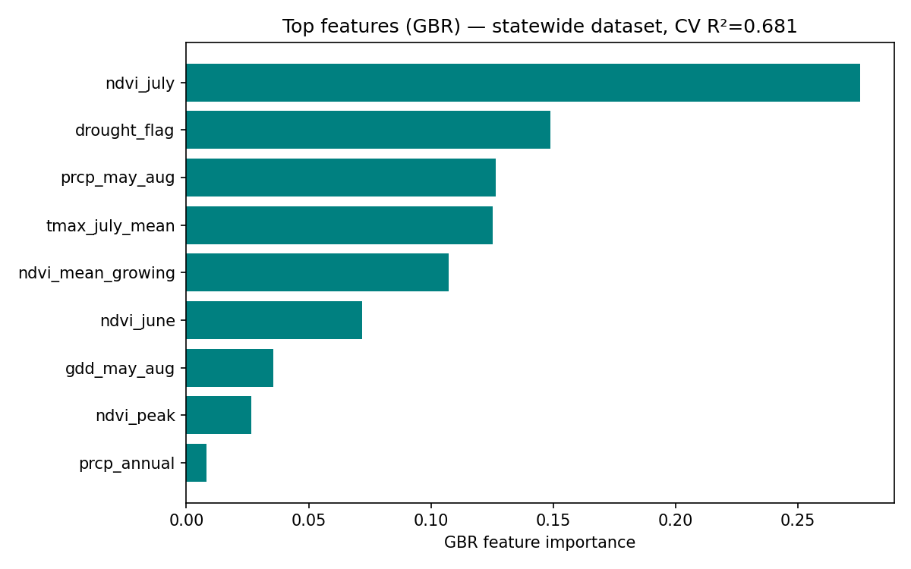
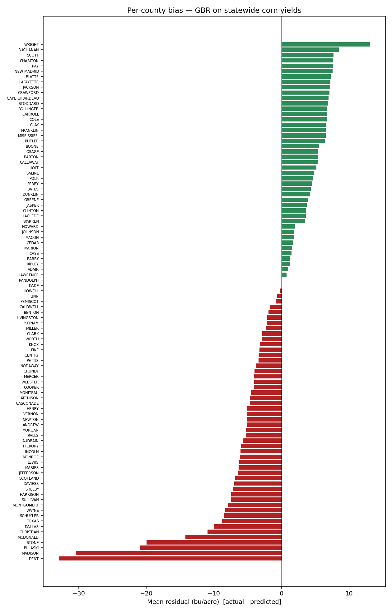
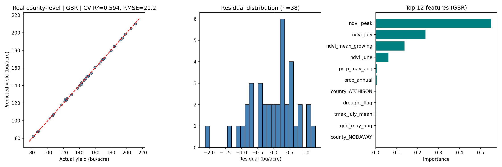
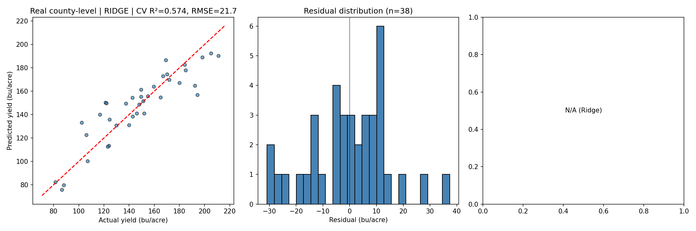
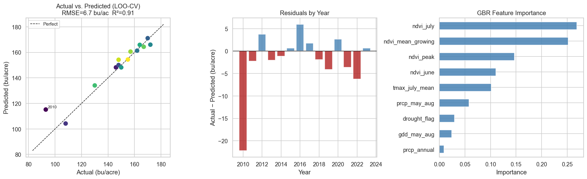
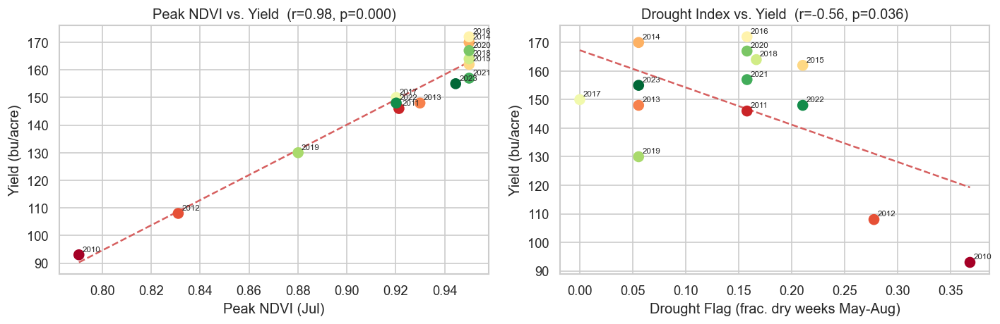

# Agri Yield Pipeline

End-to-end agricultural monitoring system: satellite NDVI (Sentinel-2 via Google Earth Engine), real-time NOAA/USDA ingestion, Kafka streaming, InfluxDB/PostgreSQL storage, and ML yield prediction for Missouri corn production.

## Takeaways

**Data (2001–2023, 97 MO counties, 1,658 county-years):**

- **NDVI → yield signal is real but heterogeneous.** Pearson r = 0.52 between
  peak summer NDVI and corn yield statewide; GBR CV R² = 0.681 vs 0.785 for the
  6 homogeneous NW-county subset. A single state-wide regression
  under-predicts on the glacial-till corn belt and over-predicts on Ozark
  pasture / Bootheel rice paddies.
- **July is the hinge month.** `ndvi_july` is the single most important
  feature (0.28), followed by `drought_flag` (0.15), `prcp_may_aug` (0.13),
  and `tmax_july_mean` (0.13). Pollination-window stress dominates annual
  yield variance.
- **Known drought years show up cleanly** in the statewide trend lines for
  2012 and 2022 across corn / soy / sorghum — sanity check that MODIS +
  GHCND + NASS are aligned.
- **GBR beats Ridge by ~3×** on R² (0.681 vs 0.208). The 97 county one-hot
  features are too coarse for a linear model to recover per-region intercepts.
- **Top corn counties** in the 2015–2023 average cluster along the Missouri
  River bottom (Atchison, Holt, Nodaway, Andrew, Buchanan) — consistent with
  published USDA rankings.

**Pipeline:**

- Baseline runs end-to-end from cached parquets with no Kafka / Postgres /
  InfluxDB. `dash_baseline.py` is the proof: `python dash_baseline.py`
  → `http://127.0.0.1:8050`.
- Kaleido + remote-geojson hangs in headless Chromium; the matplotlib
  centroid-bubble fallback (`scripts/generate_choropleth_static.py`) is
  reliable and renders in < 1 s.
- The 8-commodity USDA pull
  (`data/real/usda_allcrops_county_missouri_2001_2023.parquet`, 7,890 rows,
  116 counties) feeds both the ML baseline and the companion `career-ops`
  MO-geo job scorer — same parquet, two consumers.

## ML Results

**Statewide real-data baseline** — MODIS MOD13Q1 NDVI (250 m, 16-day composite) +
NOAA GHCND daily weather + USDA NASS county yields, **97 Missouri counties**,
2001–2023, **1,658 county-years × 106 features** (including one-hot county effects):

| Model            | CV R² | CV RMSE (bu/acre) | Train R² |
|------------------|-------|-------------------|----------|
| Ridge            | 0.208 | 30.5              | 0.757    |
| GradientBoosting | **0.681** | **19.4**      | 0.826    |

Top GBR features (statewide): `ndvi_july` (0.28), `drought_flag` (0.15),
`prcp_may_aug` (0.13), `tmax_july_mean` (0.13), `ndvi_mean_growing` (0.11).
Going from 6 homogeneous NW counties (R²=0.785) to all 97 yield-bearing
counties (R²=0.681) reflects real agroclimatic heterogeneity: the Bootheel
rice paddies, Ozark pasture, and Glacial-till corn belt don't share a single
NDVI→yield slope.

### Corn yield map — avg 2015-2023


Interactive (plotly): [`figures/real/choropleth_corn_yield.html`](figures/real/choropleth_corn_yield.html).

### NDVI vs corn yield (full state)


Pearson r = 0.52 between peak summer NDVI and corn yield across 1,658 observations.

### Multi-crop coverage



USDA NASS coverage for 8 commodities (CORN, SOYBEANS, WHEAT, SORGHUM, COTTON,
RICE, OATS, HAY) written to `data/real/usda_allcrops_county_missouri_2001_2023.parquet`
(7,890 rows, 116 counties).

### GBR feature importance + per-county residuals



### Earlier models



**Synthetic-data reference** (14-year single-county dataset, LOO-CV): GBR R² = 0.80, RMSE = 9.9 bu/acre.




## Table of Contents
1. [Quickstart: Analysis Notebook](#quickstart-analysis-notebook)
2. [Prerequisites](#prerequisites)
3. [Clone & Setup](#clone--setup)
4. [Environment Configuration](#environment-configuration)
5. [Docker Services](#docker-services)
6. [Real-Time Data Ingestion](#real-time-data-ingestion)
7. [Stream Processing](#stream-processing)
8. [Dashboard Access](#dashboard-access)
9. [API Endpoints](#api-endpoints)
10. [Troubleshooting Tips](#troubleshooting-tips)

## Quickstart: Analysis Notebook

Run the full ML pipeline without any API keys — uses embedded 14-year Missouri corn data:

```bash
pip install -r requirements.txt
jupyter notebook notebooks/ndvi_analysis.ipynb
```

The notebook runs end-to-end:
- Generates synthetic NDVI + weather series with realistic agronomic signals (2012 drought, 2019 late-planting)
- Builds feature matrix: ndvi_peak, ndvi_mean_growing, ndvi_july/june, prcp_may_aug, gdd_may_aug, drought_flag, tmax_july_mean
- Trains Ridge and GradientBoosting models with LOO-CV
- Outputs correlation heatmap, actual vs predicted scatter, feature importance, and residual plots to `figures/`

### Real-data baseline

With `NOAA_API_TOKEN` and `USDA_API_KEY` set in `.env`:

```bash
python3.11 -m venv .venv && .venv/bin/pip install -r requirements.txt
# 6-county quick start (~5 min):
.venv/bin/python scripts/fetch_real_data.py
# Statewide MO — NDVI for every county with USDA yields (~6 h, one-time):
.venv/bin/python scripts/fetch_all_counties.py
# All 8 MO commodities (CORN, SOYBEANS, WHEAT, SORGHUM, COTTON, RICE, OATS, HAY):
.venv/bin/python scripts/fetch_usda_all_crops.py
# Train + figures:
.venv/bin/python scripts/train_real.py
.venv/bin/python scripts/generate_full_figures.py
.venv/bin/python scripts/generate_choropleth_static.py
```

MODIS NDVI comes from the ORNL DAAC REST endpoint (no auth). NOAA GHCND daily
weather and USDA NASS yields require the respective tokens. Reruns hit the
parquet cache; each NDVI parquet is 250 m × 250 m × 16-day, 2001–2023.

### Baseline dashboard (no Docker, no Postgres)

```bash
.venv/bin/python dash_baseline.py
# → http://127.0.0.1:8050
```

Reads directly from the cached parquets — county map with year-range slider,
per-crop statewide trend, per-county NDVI time series, per-county yield series.
The production `dash_app.py` still requires PostgreSQL + InfluxDB (see
[Docker Services](#docker-services)).

## Prerequisites
- Git (for cloning the repo)
- Docker & Docker Compose (v3.8+)
- Python 3.9+ (for running local scripts)
- Google Earth Engine CLI (`earthengine`)

## Clone & Setup
```bash
git clone https://github.com/aurascoper/agri_yield_pipeline.git
cd agri_yield_pipeline
```

## Environment Configuration
Create a `.env` file in the project root with the following variables:
```dotenv
NOAA_API_TOKEN=<your_noaa_api_token>
USDA_API_KEY=<your_usda_api_key>
INFLUXDB_URL=http://localhost:8086
INFLUXDB_TOKEN=<your_influxdb_token>
INFLUXDB_ORG=<your_org>
INFLUXDB_BUCKET=<your_bucket>
POSTGRES_USER=user
POSTGRES_PASSWORD=password
POSTGRES_DB=alerts
INFLUXDB_INIT_USERNAME=admin
INFLUXDB_INIT_PASSWORD=password
# (Optional) Kafka settings:
KAFKA_BOOTSTRAP_SERVERS=localhost:9092
KAFKA_GROUP_ID=processor-group
# (Optional) Redis URL:
REDIS_URL=redis://localhost:6379/0
```
Authenticate with Google Earth Engine:
```bash
earthengine authenticate
```

## Docker Services
Start core services:
```bash
docker-compose up -d
```
Services launched:
- Zookeeper & Kafka
- Redis
- PostgreSQL
- InfluxDB (initialized with your `.env` settings)
- Stream Processor
- Dash Dashboard

Check status and logs:
```bash
docker-compose ps
docker-compose logs -f
```

## Real-Time Data Ingestion
Fetch NOAA weather and USDA yield data into InfluxDB and Kafka:
```bash
python src/data_ingestion/live_ingestor.py \
  --start-date 2021-01-01 \
  --end-date 2021-12-31 \
  --station-id GHCND:USW00003952 \
  --year 2021
```

## Stream Processing
Consumes raw Kafka topics (`weather`, `yield`), enriches data, and writes to:
- Kafka output topic (`enriched-yield`)
- InfluxDB (for dashboard queries)
- Redis (for alerts cache)

Run via Docker Compose (already started above):
```bash
docker-compose up -d stream-processor
```
Or locally:
```bash
python src/processing/stream_processor.py
```

## Dashboard Access
The live Dash dashboard is available at:
http://localhost:8050

To run locally:
```bash
python src/visualization/live_dashboard.py
```

## API Endpoints
Backend API with FastAPI (NDVI & weather):
```bash
uvicorn api.main:app --reload
```
- GET `/ndvi/`
- GET `/weather/`

## Troubleshooting Tips
- Ensure `.env` is correctly configured and contains all required variables.  
- Verify no port conflicts on 5432, 6379, 8086, 8050, and 9092.  
- Use `docker-compose ps` and `docker-compose logs <service>` for diagnostics.  
- Access InfluxDB UI at http://localhost:8086 (use credentials from `.env`).  
- Test Redis with `redis-cli -u redis://localhost:6379/0`.  
- Confirm Google Earth Engine authentication: `earthengine authenticate`.  
