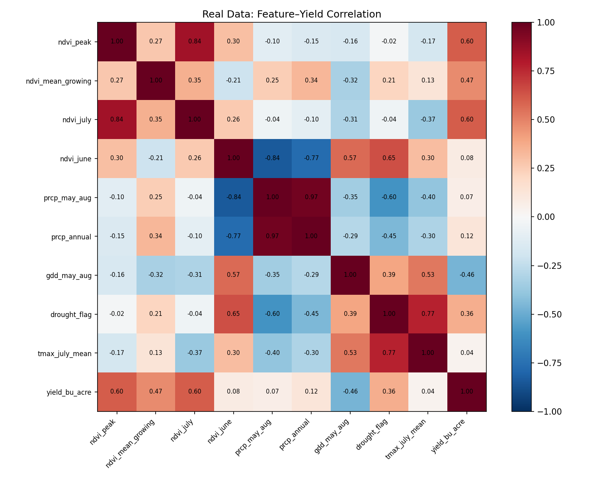

# Agri Yield Pipeline

End-to-end agricultural monitoring system: satellite NDVI (Sentinel-2 via Google Earth Engine), real-time NOAA/USDA ingestion, Kafka streaming, InfluxDB/PostgreSQL storage, and ML yield prediction for Missouri corn production.

## ML Results

**Real-data baseline** (MODIS MOD13Q1 NDVI + NOAA GHCND + USDA NASS, 6 NW Missouri counties, 2001–2023, 111 county-years × 15 features):

| Model            | CV R² | CV RMSE (bu/acre) | Train R² |
|------------------|-------|-------------------|----------|
| Ridge            | 0.558 | 21.7              | 0.757    |
| GradientBoosting | **0.785** | **15.2**      | 0.996    |




**Synthetic-data reference** (14-year single-county dataset, LOO-CV): GBR R² = 0.80, RMSE = 9.9 bu/acre.


## Table of Contents
1. [Quickstart: Analysis Notebook](#quickstart-analysis-notebook)
2. [Prerequisites](#prerequisites)
3. [Clone & Setup](#clone--setup)
4. [Environment Configuration](#environment-configuration)
5. [Docker Services](#docker-services)
6. [Real-Time Data Ingestion](#real-time-data-ingestion)
7. [Stream Processing](#stream-processing)
8. [Dashboard Access](#dashboard-access)
9. [API Endpoints](#api-endpoints)
10. [Troubleshooting Tips](#troubleshooting-tips)

## Quickstart: Analysis Notebook

Run the full ML pipeline without any API keys — uses embedded 14-year Missouri corn data:

```bash
pip install -r requirements.txt
jupyter notebook notebooks/ndvi_analysis.ipynb
```

The notebook runs end-to-end:
- Generates synthetic NDVI + weather series with realistic agronomic signals (2012 drought, 2019 late-planting)
- Builds feature matrix: ndvi_peak, ndvi_mean_growing, ndvi_july/june, prcp_may_aug, gdd_may_aug, drought_flag, tmax_july_mean
- Trains Ridge and GradientBoosting models with LOO-CV
- Outputs correlation heatmap, actual vs predicted scatter, feature importance, and residual plots to `figures/`

### Real-data baseline

With `NOAA_API_TOKEN` and `USDA_API_KEY` set in `.env`:

```bash
python3.11 -m venv .venv && .venv/bin/pip install -r requirements.txt
.venv/bin/python scripts/fetch_real_data.py   # caches parquets in data/real/
.venv/bin/python scripts/train_real.py        # writes figures/real/
```

Fetches MODIS MOD13Q1 NDVI (ORNL DAAC REST, no auth), NOAA GHCND daily weather, and USDA NASS county corn yields. Reruns hit the parquet cache.

## Prerequisites
- Git (for cloning the repo)
- Docker & Docker Compose (v3.8+)
- Python 3.9+ (for running local scripts)
- Google Earth Engine CLI (`earthengine`)

## Clone & Setup
```bash
git clone https://github.com/aurascoper/agri_yield_pipeline.git
cd agri_yield_pipeline
```

## Environment Configuration
Create a `.env` file in the project root with the following variables:
```dotenv
NOAA_API_TOKEN=<your_noaa_api_token>
USDA_API_KEY=<your_usda_api_key>
INFLUXDB_URL=http://localhost:8086
INFLUXDB_TOKEN=<your_influxdb_token>
INFLUXDB_ORG=<your_org>
INFLUXDB_BUCKET=<your_bucket>
POSTGRES_USER=user
POSTGRES_PASSWORD=password
POSTGRES_DB=alerts
INFLUXDB_INIT_USERNAME=admin
INFLUXDB_INIT_PASSWORD=password
# (Optional) Kafka settings:
KAFKA_BOOTSTRAP_SERVERS=localhost:9092
KAFKA_GROUP_ID=processor-group
# (Optional) Redis URL:
REDIS_URL=redis://localhost:6379/0
```
Authenticate with Google Earth Engine:
```bash
earthengine authenticate
```

## Docker Services
Start core services:
```bash
docker-compose up -d
```
Services launched:
- Zookeeper & Kafka
- Redis
- PostgreSQL
- InfluxDB (initialized with your `.env` settings)
- Stream Processor
- Dash Dashboard

Check status and logs:
```bash
docker-compose ps
docker-compose logs -f
```

## Real-Time Data Ingestion
Fetch NOAA weather and USDA yield data into InfluxDB and Kafka:
```bash
python src/data_ingestion/live_ingestor.py \
  --start-date 2021-01-01 \
  --end-date 2021-12-31 \
  --station-id GHCND:USW00003952 \
  --year 2021
```

## Stream Processing
Consumes raw Kafka topics (`weather`, `yield`), enriches data, and writes to:
- Kafka output topic (`enriched-yield`)
- InfluxDB (for dashboard queries)
- Redis (for alerts cache)

Run via Docker Compose (already started above):
```bash
docker-compose up -d stream-processor
```
Or locally:
```bash
python src/processing/stream_processor.py
```

## Dashboard Access
The live Dash dashboard is available at:
http://localhost:8050

To run locally:
```bash
python src/visualization/live_dashboard.py
```

## API Endpoints
Backend API with FastAPI (NDVI & weather):
```bash
uvicorn api.main:app --reload
```
- GET `/ndvi/`
- GET `/weather/`

## Troubleshooting Tips
- Ensure `.env` is correctly configured and contains all required variables.  
- Verify no port conflicts on 5432, 6379, 8086, 8050, and 9092.  
- Use `docker-compose ps` and `docker-compose logs <service>` for diagnostics.  
- Access InfluxDB UI at http://localhost:8086 (use credentials from `.env`).  
- Test Redis with `redis-cli -u redis://localhost:6379/0`.  
- Confirm Google Earth Engine authentication: `earthengine authenticate`.  
