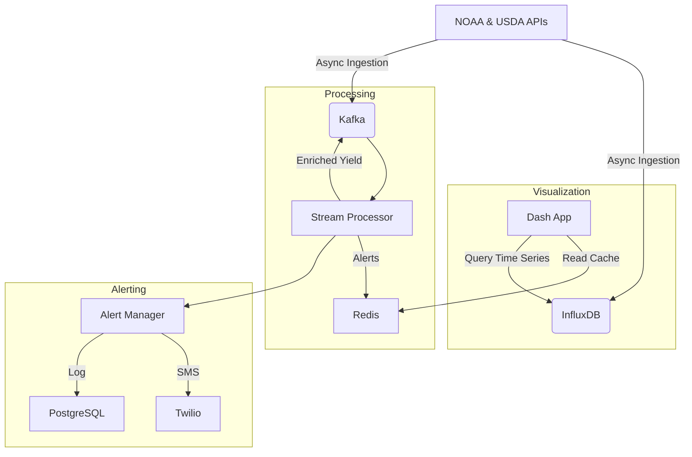

# Real-Time Data Ingestion, Processing, Visualization & Alerting Pipeline

## 1. Architecture Overview



This pipeline enables real-time ingestion of weather and yield data, stream processing for enrichment and anomaly detection, time-series storage in InfluxDB, live dashboarding via Dash, and health alerting through SMS and database logging.

---

## 2. Configuration

- Primary YAML: `config/pipeline_config.yml` defines:
  - NOAA & USDA API settings
  - Kafka bootstrap servers & topic names
  - InfluxDB connection (URL, token, org, bucket)
  - Redis URL & cache keys
  - Visualization update interval & alert thresholds
- Environment variables in a `.env` file (load via `python-dotenv` or Docker Compose):
  ```dotenv
  # NOAA/USDA
  NOAA_TOKEN=your_noaa_token
  USDA_API_KEY=your_usda_key

  # Kafka
  KAFKA_BOOTSTRAP_SERVERS=localhost:9092
  KAFKA_GROUP_ID=agri_processor
  KAFKA_WEATHER_TOPIC=noaa_weather
  KAFKA_YIELD_TOPIC=usda_yield
  KAFKA_OUTPUT_TOPIC=enriched_yield

  # InfluxDB
  INFLUXDB_URL=http://localhost:8086
  INFLUXDB_TOKEN=your_influx_token
  INFLUXDB_ORG=your_org
  INFLUXDB_BUCKET=your_bucket

  # Redis
  REDIS_URL=redis://localhost:6379/0
  REDIS_WEATHER_KEY=weather_data
  REDIS_YIELD_KEY=yield_data
  REDIS_ALERTS_KEY=alerts

  # Twilio
  TWILIO_ACCOUNT_SID=ACxxx
  TWILIO_AUTH_TOKEN=xxxx
  TWILIO_FROM_NUMBER=+1234567890
  TWILIO_TO_NUMBER=+1987654321

  # PostgreSQL DSN
  POSTGRES_DSN=postgresql://user:pass@db:5432/alerts
  ```

---

## 3. Kafka & InfluxDB Setup

### Docker Compose
1. Start services:
   ```bash
   docker-compose up -d zookeeper kafka influxdb redis
   ```
2. Create Kafka topics:
   ```bash
   docker exec kafka \
     kafka-topics --create --topic noaa_weather \
     --bootstrap-server localhost:9092 --partitions 1 --replication-factor 1
   docker exec kafka \
     kafka-topics --create --topic usda_yield \
     --bootstrap-server localhost:9092 --partitions 1 --replication-factor 1
   docker exec kafka \
     kafka-topics --create --topic enriched_yield \
     --bootstrap-server localhost:9092 --partitions 1 --replication-factor 1
   ```

### InfluxDB Initialization
- Uses Docker volume `influxdb-init` for `/docker-entrypoint-initdb.d`
- Initial setup via `INFLUXDB_INIT_*` env vars in Compose.
- Access UI at http://localhost:8086

---

## 4. Dashboard Usage

1. Install Python requirements:
   ```bash
   pip install dash dash-leaflet plotly pandas redis python-dotenv
   ```
2. Run:
   ```bash
   python src/visualization/live_dashboard.py
   ```
3. Open browser at http://localhost:8050

The dashboard:
- Displays a Leaflet map centered on Missouri
- Shows live-updating precipitation & yield charts
- Lists current alerts in a panel

---

## 5. Alert Handling Process

1. **Heartbeat Recording**: Each ingestion or processor emits `record_heartbeat(stream_name)`.
2. **Periodic Check**: Call `check_streams()` (e.g., every minute) to detect downtime.
3. **Alert Trigger**: On threshold breach, `_alert()` logs to PostgreSQL and sends SMS via Twilio.
4. **Deduplication**: Active alerts are suppressed until `ack(stream_name)` is called.
5. **Acknowledgment**: Manual or automated resolution calls `ack()` to mark incidents acknowledged.

---

## 6. Glossary
- **Ingestion**: Asynchronous fetching of API data (NOAA, USDA) into Kafka & InfluxDB.
- **Stream Processor**: Kafka consumer that enriches yield with weather metrics, computes rolling averages, and detects events.
- **Enrichment**: Combining yield records with recent temperature & precipitation statistics.
- **Rolling Window**: Time-based deque storing recent measurements for computing averages.
- **Avro**: Serialization format for Kafka messages.
- **Dash**: Python framework for building interactive web dashboards.
- **Redis**: In-memory cache for sharing data between producer and dashboard.
- **Heartbeat**: Timestamp emitted to track a stream’s health.
- **Threshold**: Maximum allowed downtime before raising an alert.
- **Alert Manager**: Component that monitors heartbeats, sends notifications, and logs incidents.
- **Twilio**: SMS API used for sending text alerts.
- **PostgreSQL**: Relational DB for persisting alert incidents.