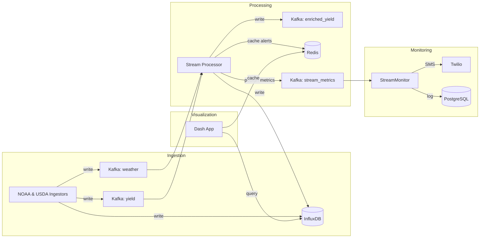

# Real-Time Agricultural Pipeline
> End-to-end system for ingesting, processing, visualizing, and alerting on NDVI, weather, and yield data.

## 1. Architecture



---
## 2. Prerequisites
- Docker & Docker Compose (v3.8+)
- Python ≥3.9 for local dev (for non-container workflows)
- `.env` file (copy from `.env.template` and fill in secrets)
- `config/pipeline_config.yml` for API, Kafka, InfluxDB, Redis, and alerts

---
## 3. Kafka & Ingestor Setup
1. Start Zookeeper & Kafka:
   ```bash
   docker-compose up -d zookeeper kafka
   ```
2. Create required topics:
   ```bash
   for topic in noaa_weather usda_yield enriched_yield stream_metrics; do
     docker exec kafka \  
       kafka-topics --create --topic $topic \
         --bootstrap-server kafka:9092 --partitions 3 --replication-factor 1
   done
   ```

---
## 4. Ingestors
- **Location**: `src/data_ingestion/live_ingestor.py`
- Fetches NDVI, weather, and yield data from APIs
- Writes raw points to InfluxDB **and** publishes to Kafka topics
- Configuration via `config/pipeline_config.yml` or environment variables
- Run locally:
  ```bash
  python src/data_ingestion/live_ingestor.py
  ```

---
## 5. Stream Processing
- **Service**: `stream-processor` (script: `src/processing/stream_processor.py`)
- Consumes `weather` & `yield` topics
- Computes rolling averages, detects events (drought/flood)
- Outputs enriched yield to `enriched_yield`, writes to InfluxDB
- Emits processing metrics to `stream_metrics`
- Start via Docker:
  ```bash
  docker-compose up -d stream-processor
  ```

---
## 6. InfluxDB & Redis
- **InfluxDB v2** stores time-series metrics and sensor data
  - Initialized via Docker Compose (`INFLUXDB_INIT_*` variables)
  - UI: http://localhost:8086
- **Redis** caches query results and alert messages
  - Default: `redis://localhost:6379/0`
  - CLI: `redis-cli`

---
## 7. Dashboard Usage
- **Service**: `dash-app` (script: `src/visualization/live_dashboard.py`)
- Launch:
  ```bash
  docker-compose up -d dash-app
  ```
- View at http://localhost:8050
- Features:
  1. Missouri Leaflet map: NDVI heatmap, weather & yield markers
  2. Time-series charts: precipitation & yield (last 24h)
  3. Real-time alert panel (latest via Redis)

---
## 8. Alerting & Monitoring
- **Component**: `StreamMonitor` in `src/src/monitoring/alert_manager.py`
  - Consumes `stream_metrics`, applies thresholds (`lag`, `error_rate`)
  - Sends SMS via Twilio on anomalies
  - Logs to PostgreSQL table `monitor_events`
  - Tracks acknowledgments to suppress duplicates
- Run locally:
  ```bash
  python src/src/monitoring/alert_manager.py
  ```
  Or:
  ```bash
  docker-compose up -d stream-monitor
  ```

---
## 9. Operational Tips
- Check service health: `docker-compose ps`, `docker logs <service>`
- Inspect Kafka traffic:
  ```bash
  kafka-console-consumer --bootstrap-server localhost:9092 --topic noaa_weather --from-beginning
  ```
- Tune InfluxDB retention via `InfluxDBWriter.setup_retention(hours)`
- Adjust Redis TTL for cache freshness vs. load
- Scale Kafka partitions/consumers for throughput
- Secure secrets with Docker secrets or Vault for production